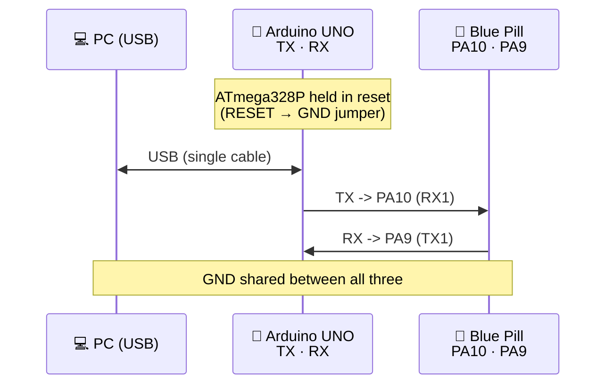

# Using an Arduino UNO as a USB-Serial Converter for the Blue Pill

Quick guide to using an Arduino UNO as a USB↔Serial bridge to read the Zephyr
console (UART1) on the Blue Pill, without needing a dedicated FTDI/CP2102
converter.

## Why this works

The Arduino UNO has a USB-Serial chip that is separate from the main
microcontroller (ATmega328P). That chip is the only thing we need — it
translates between the PC's USB port and the TX/RX lines. It doesn't matter
whether the ATmega328P has a bootloader, is programmed, or even broken.

## Wiring

The ATmega328P must be held in reset (via a jumper between **RESET** and
**GND**) so it doesn't interfere with the signals. The TX/RX lines are
**crossed** between the two boards.



| Arduino UNO       | Connects to             | Purpose                        |
|-------------------|--------------------------|---------------------------------|
| TX (pin 1)         | PA10 (RX1) — Blue Pill   | Blue Pill receives data         |
| RX (pin 0)         | PA9 (TX1) — Blue Pill    | Blue Pill transmits data        |
| GND                | GND — Blue Pill          | Common ground reference         |
| RESET              | GND (on the Arduino itself) | Holds the ATmega328P in reset |

## Step 1: Connect the Arduino to the PC and find the port

Plug the Arduino into the laptop via USB (a **data** cable, not a
charge-only one), then check which port Linux assigned:

```bash
ls /dev/ttyACM* /dev/ttyUSB*
```

Arduinos with a native USB chip (ATmega16U2, typical on the UNO R3) usually
show up as `/dev/ttyACM0`. Boards using an external FTDI/CH340 chip show up
as `/dev/ttyUSB0`.

If nothing shows up, check:
```bash
lsusb
dmesg | tail -20
```

## Step 2: Reading the serial console — different ways

### Option A: cat (read-only, no install needed)
Quick way to peek at the output without installing anything:
```bash
cat /dev/ttyACM0
```
To exit: `Ctrl-C`.

> Note: `cat` doesn't set the baud rate itself — if the port was already
> configured (e.g. by a previous `minicom` session or `stty`), this works
> fine. Otherwise set it first with `stty -F /dev/ttyACM0 115200`.

### Option B: minicom
```bash
sudo apt install minicom      # if not already installed
minicom -D /dev/ttyACM0 -b 115200
```
To exit: `Ctrl-A` then `Q`, confirm with Enter.

### Option C: Arduino IDE Serial Monitor
The Arduino IDE's built-in Serial Monitor also works, since it just opens
the same serial port:

1. Open the Arduino IDE.
2. Go to **Tools > Port** and select the Arduino's port (e.g. `/dev/ttyACM0`).
3. Set the baud rate in the Serial Monitor dropdown to **115200**.
4. Open **Tools > Serial Monitor** (or the magnifying glass icon).

> Note: the IDE doesn't need a sketch uploaded or even a working
> bootloader — it just needs the port to be free and correctly configured.
> Close any other program using the port (like `minicom`) first, since only
> one program can hold the serial port at a time.

## Expected port settings

- **Baud rate:** 115200
- **Data bits:** 8
- **Parity:** None
- **Stop bits:** 1
- (i.e. "115200 8N1", Zephyr's default console configuration)

## Notes

- If nothing appears when opening the port, power-cycle the Blue Pill
  (unplug/replug its power supply) to force a clean boot and trigger the
  startup message.
- If the Arduino's ATmega328P has no bootloader or can't be programmed,
  **it doesn't matter** for this use case — only the USB-Serial chip is
  used, never the ATmega328P itself.